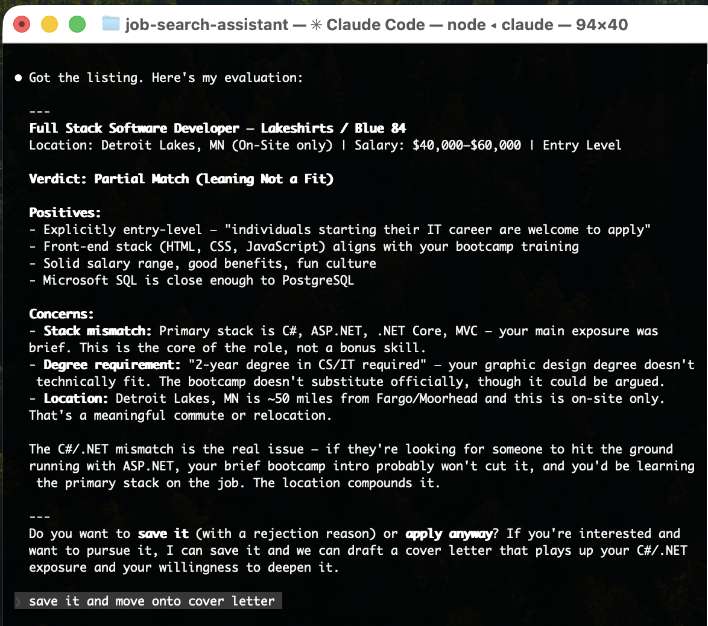
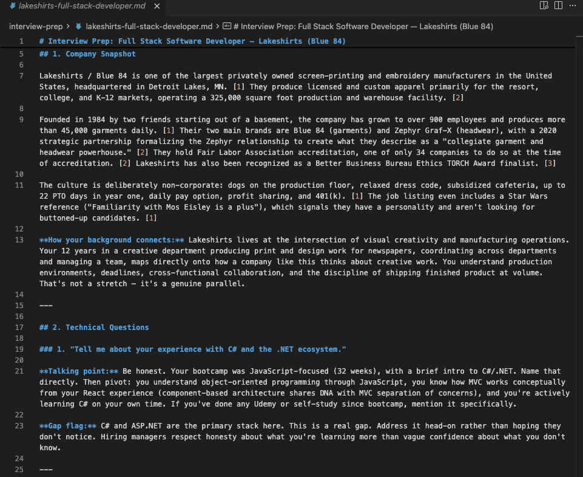

<!-- _class: title -->

# Job Search Assistant

**A personal AI agent for the full job search pipeline**

*Nick Weisser · Claude + MCP + PostgreSQL*

---

# The Problem

- **Volume** — Dozens of listings to read, score, track, and follow up on
- **Every application is custom** — Fit evaluation, tailored cover letter, targeted interview prep. Can't recycle any of it.
- **Two tracks** — Applying to both dev and design roles with completely different criteria

---

# How It Works

- **CLAUDE.md** — Full user profile, criteria, and dealbreakers as the system prompt
- **MCP: Postgres** — Persistent job tracker. Status, fit verdicts, rejection notes.
- **MCP: Firecrawl + Browser** — Paste a URL, agent scrapes it automatically
- **Subagents** — Dedicated prompts for scraping, cover letters, and interview prep

---

# Wins

- **One URL → full evaluation** — Scrape, score fit, save to database. No manual entry.
- **Cover letters in seconds** — Pulls from the stored listing, knows your background, drafts something tailored
- **Interview prep on demand** — Company research, technical Qs, STAR answers, career-change talking points. Exported to a file.
- **Dual pipeline** — Separate logic for dev vs. design roles, same interface

---

<!-- _class: end -->

# Questions?
